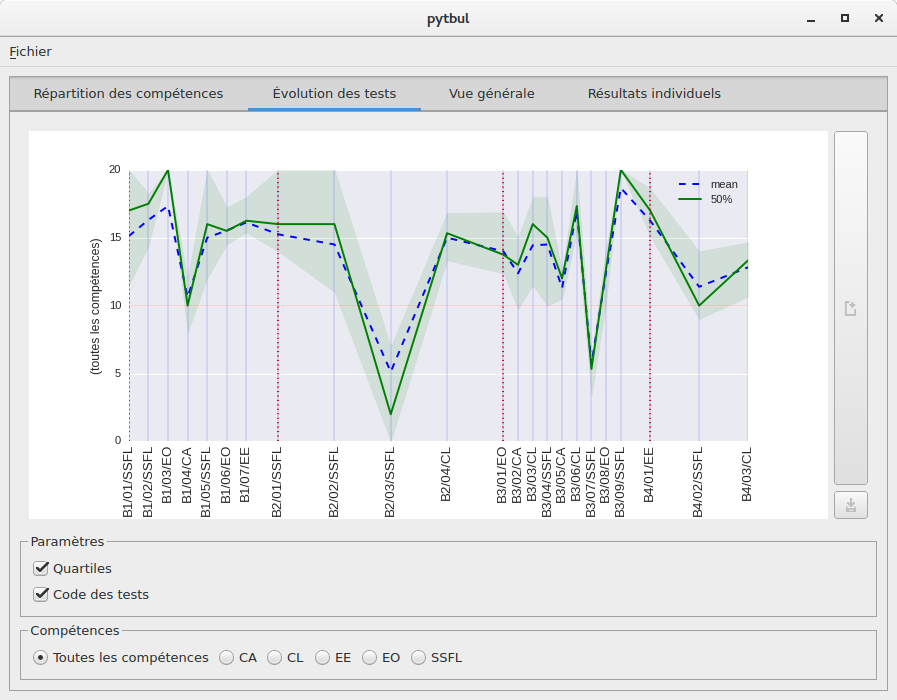

Pytbul est une application graphique Python permettant de visualiser les
résultats scolaires suivant le format de fichiers proposé par la CF.

Vu la nature spécifique du projet, il n'est pas prévu qu'il soit utilisé
indépendamment d'explications et de sources de données supplémentaires.

Pytbul nécessite Python 3.4+, les dépendances reprises dans le fichier
*requirements.txt* ainsi que PyQT5 (et donc, par extension, du framework Qt en version 5).

